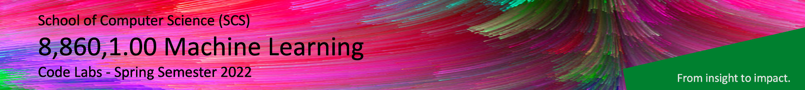

# 8,860,1.00 Machine Learning - Coding Labs

<!--  -->

Dear Machine Learning course participants,

welcome to our 8,860,1.00 elective course **Machine Learning**, taught by **Prof. Dr. Damian Borth**. In this course, lectures and hands-on lab courses alternate to provide a better learning experience. The lab course materials for Python programming, Machine Learning und Deep Learning are available in and accessible through this repository.

Please use a laptop computer for the lab courses (not a tablet) to be able to fully participate in the exercises.

Happy Coding!

Your Machine Learning Teaching Team

---

This table lists all coding lab notebooks:

| Date                      |  Topic                            |  CoLab Notebook                       | MyBinder Notebook | 
|:-----------------------:|:---------------------------------:|:-------------------------------:|:-------:|
|  < Mon, Jan 17 | Prerequisite | - |  |

| Mon, Jan 17               |  Python 101: Jupyter Notebooks and Python Basics               |                                  |       |

| Tue, Jan 18, morning session     |  Python 102: Numerical Math & Images   |                                  |     |

| Tue, Jan 18, afternoon session     |  Machine Learning I (Naive Bayes)               |    |   |

| Tue, Jan 18, afternoon session     |  Machine Learning II (k Nearest-Neighbors)               |    |   |

| Wed, Jan 19, morning session     |  Deep Learning I (Artificial Neural Nets)     |   |   |

| Wed, Jan 19, afternoon session     |  Deep Learning II (Convolutional Neural Nets) |   |   |

| < TBD          |  Exam Exercise | -  |   |
