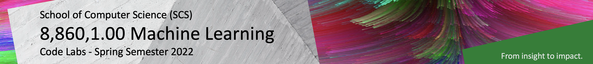

# 8,860,1.00 Machine Learning - Code Labs

<!--  -->

Dear Machine Learning enthusiasts,

Welcome to our 8,860,1.00 elective course **Machine Learning**, taught by **Prof. Dr. Damian Borth**. Lectures and hands-on lab courses alternate to provide a better learning experience in this course. The lab course materials for Python programming, Machine Learning, and Deep Learning are available and accessible through this repository.

Please use a laptop computer for the lab courses (not a tablet) to fully participate in the code labs.

Happy Coding!

Your Machine Learning Teaching Team

---

This table lists all code lab notebooks:

| Date                      |  Content                           |  CoLab Notebook                       | MyBinder Notebook | 
|:-----------------------:|:---------------------------------:|:-------------------------------:|:-------:|
|  < Mon, Jan 17                   | Prerequisite |  | |
| Mon, Jan 17.                     |  Python 101: Jupyter Notebooks and Python Basics  | - | - |
| Tue, Jan 18, morning session     |  Python 102: Numerical Math & Images              | - | - |
| Tue, Jan 18, afternoon session   |  Machine Learning I (Naive Bayes)             | - | - |
| Tue, Jan 18, afternoon session   |  Machine Learning II (k Nearest-Neighbors)    | - | - |
| Wed, Jan 19, morning session     |  Deep Learning I (Artificial Neural Nets)     | - | - |
| Wed, Jan 19, afternoon session   |  Deep Learning II (Convolutional Neural Nets) | - | - |
| < TBD                            |  Exam Exercise | - | - |

---

This table lists all coding challenge notebooks:

| Date                      |  Content                          |  CoLab Notebook                       | MyBinder Notebook | 
|:-----------------------:|:---------------------------------:|:-------------------------------:|:-------:|
|  tbd | tbd | Kickstarter Notebook | - |
